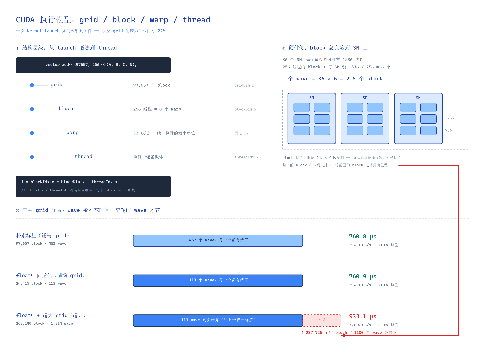

# 02 · CUDA 算子优化基本功

这一篇的东西在任何 GPU 算子上都成立。**LLM 里 80% 的 kernel 性能问题，最后都落到下面这几条上。**

## 0. 执行模型：grid / block / warp / thread

后面每一节都建立在这一节的四个概念上——合并访存要数「一个 warp 的 32 个线程」，
bank conflict 要数「32 个 bank」，occupancy 要数「每 SM 多少个 warp」。
**跳过这节，后面每个词都得现查。**



*上面这张图就是本节 0.1 – 0.6 的全部内容：左边是四层结构，右上是 block 怎么落到 SM 上，
下面是三种 grid 配置的实测对比。需要改的话，把
[diagrams/cuda-execution-model.excalidraw](diagrams/cuda-execution-model.excalidraw)
拖进 [excalidraw.com](https://excalidraw.com) 就行。*

### 0.1 四层结构

调用一次 kernel，硬件实际看到的结构是：

```
kernel launch
└── grid            这次 launch 的全部 block            gridDim   (x, y, z)
    └── block       硬件调度的最小单位，不能跨 SM        blockDim  (x, y, z)
        └── warp    32 个线程一组，不可拆分               固定 32
            └── thread      一个线程执行一遍函数体        threadIdx (x, y, z)
```

对应到代码：

```cuda
vector_add<<<blocksPerGrid, threadsPerBlock>>>(A, B, C, N);
//            └ gridDim.x   └ blockDim.x

__global__ void vector_add(const float* A, const float* B, float* C, int N) {
    int i = blockIdx.x * blockDim.x + threadIdx.x;
    //      └ 第几个块   └ 一块几个    └ 块内第几个
    if (i < N) C[i] = A[i] + B[i];
}
```

三个维度都支持（`.x/.y/.z`），但**绝大多数 kernel 只用 `.x`**，本篇也只用 `.x`。

### 0.2 四个内置变量

这四个是 CUDA 内置的 `__device__` 变量，kernel 里直接用，不需要当参数传：

| 变量 | 含义 | 本题取值 |
| --- | --- | --- |
| `gridDim.x` | 这个 grid 有多少个 block | `cdiv(N, 256)`，N=25e6 时是 97,657 |
| `blockIdx.x` | 当前 block 在 grid 里的编号 | `0 .. gridDim.x-1` |
| `blockDim.x` | 一个 block 有多少线程 | 256 |
| `threadIdx.x` | 当前线程在 block 内的编号 | `0 .. blockDim.x-1` |

由此得到**全局索引公式**——每个线程算出「我负责第几个元素」：

```
i = blockIdx.x * blockDim.x + threadIdx.x
```

> **最容易搞混的一点：`blockIdx` 和 `threadIdx` 都是「组内相对编号」，不是全局编号。**
> 每一个 block 的 `threadIdx.x` 都从 0 重新开始数。所以必须 `blockIdx.x * blockDim.x`
> 把它抬到正确的基址上，再加上组内偏移。

### 0.3 为什么要分两层

如果只有「线程」这一层，硬件调度器要管理 2500 万个独立线程，不现实。分层的理由是：

- **block 是调度单位。** 一个 block 只能**整个**丢到某一个 SM 上跑，不能拆开分到多个 SM。
  硬件只需要决定「把哪个 block 发给哪个 SM」，决策粒度从千万降到几万。
- **block 是资源单位。** 一个 block 独占一定量的寄存器、共享内存和 block slot。
  SM 能同时装下几个 block，由寄存器、共享内存、block 数上限里**最紧的那个**决定（见 4. Occupancy）。
- **block 是同步单位。** `__syncthreads()` 只能同步**同一个 block 内**的线程。
  跨 block 的同步必须靠重新 launch 一个 kernel，或者 cooperative groups。

反过来说：**block 之间是互相独立、可以任意顺序执行的**。这是 GPU 能大规模并行的根本原因，
也是「不要假设 block 的执行顺序」这条规则的来源——它没有保证。

### 0.4 warp：被隐藏的第三层

block 之下还有一层，是硬件**真正执行的最小单位**：**warp = 32 个线程**。

```
block（blockDim.x = 256）
├── warp 0   ← threadIdx.x   0 ~  31
├── warp 1   ← threadIdx.x  32 ~  63
├── warp 2   ← threadIdx.x  64 ~  95
├── ...
└── warp 7   ← threadIdx.x 224 ~ 255
```

对应关系就是整除：**`warp 编号 = threadIdx.x / 32`**。
一个 block 有多少线程，就有 `blockDim.x / 32` 个 warp（向上取整）。256 → **8 个 warp**。

warp 有三条性质，后面所有性能现象都是从它们推出来的：

1. **SIMT**（Single Instruction, Multiple Threads）——同一个 warp 的 32 个线程
   **同时执行同一条指令**，只是各自的数据不同。硬件不是「一个线程一个线程地跑」，是「一个 warp 一个 warp 地跑」。
2. **32 是硬件常量**，改不了。`cudaDeviceProp.warpSize` 永远是 32。
3. **warp 内部天然同步**——32 个线程本来就锁步执行，不需要 `__syncthreads()`。

由这三条直接推出本篇的两个核心现象：

| 现象 | 在哪一节 | 原因 |
| --- | --- | --- |
| 合并访存成立不成立 | 第 1 节 | 32 个线程同时发出**一条** load，硬件一次性看这 32 个地址；连续就合并成 1~4 次事务 |
| 分支为什么会「发散」 | 第 6 节 | 同一 warp 内线程走不同分支时，硬件没法只跑一半，只能**两条路都执行一遍** |
| bank conflict 为什么按 32 算 | 第 2 节 | 共享内存正好切 32 个 bank，一个 warp 一次访问刚好一个 bank 一个地址 |

> **`blockDim` 必须取 32 的倍数。** 否则最后一个不满的 warp 会被硬件闲置一部分
> 执行槽——白占资源不出活。256 / 512 是最常用的取值。

### 0.5 硬件上限（RTX 5060 Ti / sm_120 实测）

block 不是想发多少发多少。SM 能同时「装下」多少线程、多少 warp、多少 block 都有硬上限。
下面是本机用 `cudaGetDeviceProperties` 实测出来的（查询程序见
[examples/leetgpu/01_vector_add/device_query.cu](../../examples/leetgpu/01_vector_add/device_query.cu)）：

| 属性 | 值 | 说明 |
| --- | --- | --- |
| `multiProcessorCount` | 36 | SM 数量 |
| `warpSize` | 32 | warp 大小，恒定 |
| `maxThreadsPerBlock` | 1024 | 单个 block 的线程上限 |
| `maxThreadsPerMultiProcessor` | **1536** | 一个 SM 最多同时驻留 1536 线程 = **48 warp** |
| `maxBlocksPerMultiprocessor` | **24** | 一个 SM 最多同时驻留 24 个 block |
| `regsPerMultiprocessor` | 65536 | 寄存器总量；满载时每线程只能分到 42 个 |
| `sharedMemPerMultiprocessor` | 100 KB | 片上共享内存（第 2 节用） |
| `l2CacheSize` | 32 MB | |

**「驻留」（resident）是这里的关键词**：一个 SM 同时只能装下 1536 个线程。
整个 GPU 的驻留线程总数是：

```
36 SM × 1536 线程/SM = 55,296 线程
```

超过这个数的线程**不会同时存在**——它们排在队列里，等前面的 block 跑完腾出位置。
这也解释了为什么看 `occupancy` 时要按「每 SM 多少 warp」算，而不是按「总共发了多少线程」。

### 0.6 block 的调度：wave（波次）

把上面串起来，一次 kernel 跑起来的真实过程是：

```
grid 里的 block 排队等着
    ↓ work distributor 大致按 blockIdx 顺序派发
┌───────────────── 每个 SM ─────────────────┐
│  最多同时装：1536 线程 / 48 warp / 24 block │
│  装满了 → 后面的 block 在队列里等           │
└────────────────────────────────────────────┘
    ↓ 某个 block 跑完并「退休」（retire），腾出槽位
    ↓ 立刻派发下一个 block 补上
  ... 直到 grid 里的 block 全部跑完
```

**把当前这批驻留容量全部消耗掉，叫一个 wave（波次）。**

用 256 线程的 block 时，每个 SM 装 `1536 / 256 = 6` 个 block
（6 < 24 的 block 上限，所以瓶颈是线程数而不是 block 槽位）。于是：

```
一个 wave = 36 SM × 6 block = 216 个 block
wave 数 = 总 block 数 / 216
```

代进 [01-vector-add.md](../leetgpu/01-vector-add.md) 那题的三种配置：

| 配置 | block 数 | 线程数 | wave 数 |
| --- | --- | --- | --- |
| 朴素标量（铺满 grid） | 97,657 | 25,000,192 | 452 |
| `float4` 铺满（`cdiv(n4, 256)`） | 24,415 | 6,250,240 | **113** |
| `float4` 超订（`65535*4`） | 262,140 | 67,107,840 | **1,214** |

注意前两行的 wave 数差了 **4 倍**，实测耗时却基本相同。这告诉我们：

> **wave 数本身不是问题，不需要节省。真正的浪费是「一个 wave 里所有 block 都不干活」。**
> 前两行的每个 block 都有活干，SM 从头到尾都是满的，多几百个 wave 不花额外时间。

第三行才是问题所在。它的 grid-stride 步长 `stride = 262140 × 256 = 67,107,840`，
而工作量 `n4` 只有 6,250,000，所以：

```
block 0 ~ 24414        每个线程跑 1 次循环        ← 有活干
block 24415 ~ 262139   连循环体都进不去           ← 237,725 个纯空转的 block
```

block 大致按编号顺序派发，于是这 23 万个空 block 排在前面的真实计算之后，
构成一条**纯粹的尾巴**：

```
[== 113 个 wave 的真实计算 ==][== 约 1100 个 wave 的空 block ==]
                                └─ 同样要派发、占槽位、启动 8 个 warp、
                                   判断一次、退休
```

这笔开销是 **+170 µs**（762 → 932 µs，慢 22%）。每个空 block 虽然不产生任何结果，
仍然要走完：派发 → **占用一个 block 槽位**（每 SM 只有 6 个给 256 线程的 block，
占了就少一个给真活）→ 分配寄存器 → 启动 8 个 warp → 算 `i`、和 `n4` 比一次 → 退休。

反过来看第一行：97,657 个 block **全都干活**（只有最后一个 block 里 192 个线程被
`if (i < N)` 挡住），452 个 wave 没有一个空转，所以慢不下来。这说明——

> **代价不来自 block 的数量，而来自「完全不干活的 block」的数量。**
> 朴素版 block 数是 float4 版的 4 倍，耗时反而打平。

**推论：grid 大小要贴着工作量配，不要给一个「看起来很大的保险值」。**

- 工作量能铺满 → 直接 `cdiv(n, threads)`，这是最简也是最快的写法；
- 只有 n 大到可能超过 `gridDim` 上限（`2^31-1`）时，才需要 cap + grid-stride 兜底；
- 想调尾波效应 → 按 `SM 数 × 每 SM block 数` 算个合理的倍数，而不是拍一个 `65535*32`。

> 精确到「派发占多少、warp 启动占多少、退休占多少」需要 Nsight 拆开看，
> 见 [08-profiling.md](08-profiling.md)。但方向是确定的：**空 block 的开销没法被掩盖，
> 因为它们后面没有真实工作可以重叠。**

### 0.7 常见误解

| 说法 | 对不对 | 更正 |
| --- | --- | --- |
| `threadIdx.x` 是线程的全局编号 | ✗ | 是**组内**编号，每个 block 都从 0 开始 |
| 一个 block 可以跑在多个 SM 上 | ✗ | block 不能拆分，整体调度到一个 SM |
| warp 可以拆成两次调度 | ✗ | warp 是执行的最小单位，32 个线程锁步 |
| `blockDim` 可以随便设 | ✗ | 必须是 32 的倍数，否则最后一个 warp 有线程被闲置 |
| 一个 block 的线程数越多越好 | ✗ | 上限 1024；block 越大，SM 能装的 block 越少，尾波浪费越大 |
| grid 开得越大越保险 | ✗ | 见 0.6：超订的 block 白占槽位，本题实测亏 22% |
| 多个 block 之间会有确定的执行顺序 | ✗ | 硬件不保证顺序，跨 block 同步必须重新 launch |
| warp 是编程接口的一部分 | ✗ | 代码里写不了 warp 级的显式控制，只能通过 `blockDim` 和 `__syncwarp` 间接影响 |

## 1. 合并访存（Memory Coalescing）—— 最重要，没有之一

GPU 的显存事务以 32 字节 / 128 字节为单位。一个 warp 的 32 个线程如果访问连续的地址，硬件会合并成 1~4 个事务；如果地址散乱，最坏情况变成 32 个事务，**带宽直接掉 32 倍**。

```cuda
// 反例：线程沿行方向走，相邻线程的地址隔了一整个 N
for (int i = tid; i < M; i += blockDim.x)
    out[i * N] = in[i * N];          // 每个线程访问不同 cache line

// 正例：线程沿列方向走，相邻线程访问连续地址
for (int j = tid; j < N; j += blockDim.x)
    out[i * N + j] = in[i * N + j];  // 一个 warp 覆盖 128 字节
```

**判断方法**：想象 warp 的第 0 号线程和第 1 号线程的地址差。等于元素大小 → 完美；等于一行长度 → 灾难。

### 向量化访存

一次搬 128 bit（`float4` / `int4` / `uint4`）而不是 32 bit，能把访存指令数降到 1/4：

> **但它不保证换来带宽**，这条经验有前提。向量化省下的是**指令发射**，不是**内存事务**——
> 一个 warp 的 32 个线程访问 32 个连续 `float`，本来就会被合并成 1 次 128 字节事务，
> 和向量化版产生的事务数一样多。所以只有在**访存没被合并**（线程跨步、不连续）
> 或**指令发射受限**（occupancy 低、每线程工作量大）时才有收益。
> 纯流式的带宽 kernel 上，`LDG.E.128` 和 `LDG.E` 实测可以做到完全一样快——
> 本仓库的实测反例见 [01-vector-add.md](../leetgpu/01-vector-add.md)（762 µs vs 761 µs，打平）。
> **先测量，再决定要不要向量化。**

```cuda
// 前提：指针 16 字节对齐，且元素数能被 4 整除
const float4* in4 = reinterpret_cast<const float4*>(in);
float4 v = in4[idx];
```

vLLM 里几乎所有 elementwise kernel 都做了这个 —— 见 `csrc/layernorm_kernels.cu` 里的 `vectorized_load` 分支。

**坑**：不对齐会直接崩（misaligned address），所以要有 fallback 标量路径：

```cuda
if (is_aligned && n % 4 == 0) { kernel_vectorized<<<...>>>(...); }
else                          { kernel_scalar<<<...>>>(...); }
```

### 结构体数组 vs 数组结构体（AoS / SoA）

```cuda
struct AoS { float x, y, z; };   // 访问 .x 时把 .y .z 也搬进来了，浪费 2/3 带宽
struct SoA { float *x, *y, *z; }; // 各自连续，按需搬运
```

KV cache 就是典型的 SoA：K 和 V 分开存，因为 attention 里不同阶段访问模式不同。

## 2. 共享内存与 Bank Conflict

共享内存被划分成 32 个 bank（每个 4 字节）。同一 warp 内两个线程访问**同一个 bank 的不同地址** → 冲突，请求被串行化。

**为什么是 32**：因为 warp 是 32 个线程（见 0.4）。硬件按「一个 warp 一次访问」来服务共享内存，
所以 bank 数正好对齐 warp 大小——理想情况下 32 个线程各占一个 bank，一个周期全部完成。
**这是 0.4 那条「warp = 32」的直接推论。**

地址到 bank 的映射规则很简单：

```
bank = (字节地址 / 4) % 32
```

也就是**连续的四字节字依次落到连续的 bank**：第 0 个字进 bank 0、第 1 个字进 bank 1……
第 32 个字又转回 bank 0。所以判断有没有冲突，就是算这个式子。

```cuda
__shared__ float tile[32][32];

// 转置访问：tid 读 tile[tid][j] —— 步长为 32，所有线程落在同一个 bank
float v = tile[threadIdx.x][j];        // 32-way conflict，慢 32 倍

// padding 一行，步长变成 33，天然错开
__shared__ float tile[32][32 + 1];
float v = tile[threadIdx.x][j];        // 无冲突
```

**把上面那段算出来。** 元素 `(r, c)` 的字节地址是 `(r*32 + c) * 4`，代进公式：

```
bank = ((r*32 + c)*4 / 4) % 32 = (r*32 + c) % 32 = c % 32
                                       ↑ r*32 是 32 的倍数，被模掉了
```

warp 里 `r = threadIdx.x`、`c = j`，所以 **`bank = j % 32 = j`，和 `threadIdx.x` 完全无关**——
32 个线程全挤在 bank `j`，只是行号不同。这就是 32-way conflict 的来源。

padding 成 `[32][33]` 之后：

```
bank = (r*33 + c) % 32 = (r*1 + j) % 32 = (r + j) % 32
        ↑ 33 % 32 = 1
```

`r` 取 0~31、`j` 固定 → bank 号是 `(0+j) % 32 ... (31+j) % 32`，**32 个互不相同**，冲突消失。

> **为什么 padding 加 1 就够、加别的行不行**：因为 32 是 2 的幂，任何 32 的倍数的步长
> 都会被取模消掉。加 1 变成 33 之后 `33 % 32 = 1`，步长才在模运算下活了下来。
> 理论上加任何和 32 互质的增量都行，但 33 最省空间。

**要点**：

- 步长是 2 的幂 → 几乎必然冲突，加个 padding 就好
- 广播（所有线程读同一地址）**不算**冲突，硬件会自动广播
- 从 vLLM / CUTLASS 抄 kernel 时，别乱改 shared memory 的 padding

### 什么时候不值得用 shared memory

单纯 elementwise 或 reduction，用 shared memory 反而多一次写读。**寄存器 + warp shuffle 更快。**

## 3. Warp Shuffle：不做 block 级同步的归约

`__shfl_down_sync` 在寄存器之间直接搬数据，不需要经过 shared memory，也就没有 `__syncthreads()`。

```cuda
// warp 内归约：5 步搞定 32 个数
__inline__ __device__ float warp_reduce_sum(float val) {
    for (int offset = 16; offset > 0; offset >>= 1)
        val += __shfl_down_sync(0xffffffff, val, offset);
    return val;
}

// block 级归约：每个 warp 先在寄存器里归约，只有 warp 之间才用 shared memory
__shared__ float shm[32];
float v = warp_reduce_sum(local);
if (threadIdx.x % 32 == 0) shm[threadIdx.x / 32] = v;
__syncthreads();
if (threadIdx.x < 32) v = warp_reduce_sum(shm[threadIdx.x]);
```

vLLM 的 RMSNorm 就是这么做的（`csrc/layernorm_kernels.cu`），整体是纯带宽瓶颈，把归约开销压到最低才有意义。

## 4. Occupancy 与寄存器压力

occupancy = 实际活跃 warp 数 / 硬件上限。它决定**用多少并行度来掩盖访存延迟**。

限制因素通常是三个，取最紧的那个：

- 寄存器 / 线程（A100 每 SM 65536 个寄存器）
- shared memory / block
- 每 SM 最大 block / warp 数

```cuda
// 用 -Xptxas -v 看实际用了多少寄存器
// 例子：255 寄存器/线程 → 每个 SM 只能跑 256 线程 → 25% occupancy

__launch_bounds__(256, 4)   // 告诉编译器：每 SM 至少 4 个 block，请把寄存器压到 64 以内
```

**并不是 occupancy 越高越好**：

- 带宽瓶颈的 kernel → occupancy 很关键（需要有足够 warp 来隐藏访存延迟）
- 计算密集、寄存器复用充分的 kernel（如 GEMM）→ 50% 甚至更低往往更快，因为减少寄存器反而会牺牲数据复用

经验：**先用 occupancy 解释现象，再决定是否要提。**

## 5. 软件流水线与异步拷贝

核心思想：**当前迭代在算的时候，下一轮的数据已经在搬了。**

```cuda
// Ampere+：cp.async 让数据从显存直接进 shared memory，不占寄存器
__pipeline_memcpy_async(&smem[next], &gmem[...], sizeof(float4));
__pipeline_commit();
__pipeline_wait_prior(0);

// Hopper+：TMA (cp.async.bulk) 更好，一条指令搬整个 tile，还能做 swizzle
```

Double buffering 的典型结构：

```cuda
load(0);
for (int k = 0; k < K; k += TILE) {
    load(k + TILE);      // 异步发起下一块
    compute(k);          // 同时算当前块
    wait(k + TILE);
}
```

这是所有高性能 GEMM / FlashAttention 的骨架，见 [03-gemm.md](03-gemm.md)。

## 6. 其它真正常用的技巧

### 用 `__restrict__` 和 `const`

帮助编译器判断没有指针别名，从而放心地做重排和缓存。

```cuda
__global__ void add(const float* __restrict__ a,
                    const float* __restrict__ b,
                          float* __restrict__ c)
```

### 分支发散

同一个 warp 里不同线程走不同分支 → 两条路都执行。用「计算代替分支」通常更快：

```cuda
// 差
if (x > 0) y = x; else y = 0;

// 好
y = fmaxf(x, 0.f);
```

### 网格步长循环（Grid-Stride Loop）

比「一个线程一个元素」更灵活，且天然支持任意尺寸输入：

```cuda
__global__ void kernel(float* a, int n) {
    for (int i = blockIdx.x * blockDim.x + threadIdx.x; i < n;
         i += gridDim.x * blockDim.x) { /* ... */ }
}
```

好处：可以刻意把 grid 大小设成 SM 数量的整数倍，做出「持久化 kernel」的效果，省掉反复启动。

### Kernel Launch 开销

一次 kernel 启动大约 3~10 微秒。decode 阶段每个 token 可能要跑几百个小 kernel，**启动开销会变成主要成本**。两个对策：

1. 用 CUDA Graph 把整个前向捕获成一张图，一次提交 → 省掉 CPU 端逐次 launch（vLLM 的 `enforce_eager=False` 走的就是这条路）
2. 融合算子，减少 kernel 数量（见 [06-fusion-layout.md](06-fusion-layout.md)）

## 检查清单

写/改完一个 kernel，按顺序过一遍：

- [ ] 相邻线程访存地址连续吗？连续的话能不能向量化到 128 bit？（先测，别默认有收益）
- [ ] grid 是贴着工作量配的吗（`cdiv(n, blockDim)`）？有没有拍一个「保险值」导致大量空 block？
- [ ] 用到 shared memory 的话，有没有 2 的幂步长导致的 bank conflict？
- [ ] `-Xptxas -v` 看寄存器数 → occupancy 是不是低到无法隐藏延迟？
- [ ] 带宽利用率（`实际字节/耗时 ÷ Peak BW`）到 70% 了吗？没到就是访存没弄好
- [ ] 有没有可以用 `__restrict__`、`fmaxf`、shuffle 消掉的东西？
- [ ] 用 CUDA Graph 了吗？kernel 是不是碎得太多？
